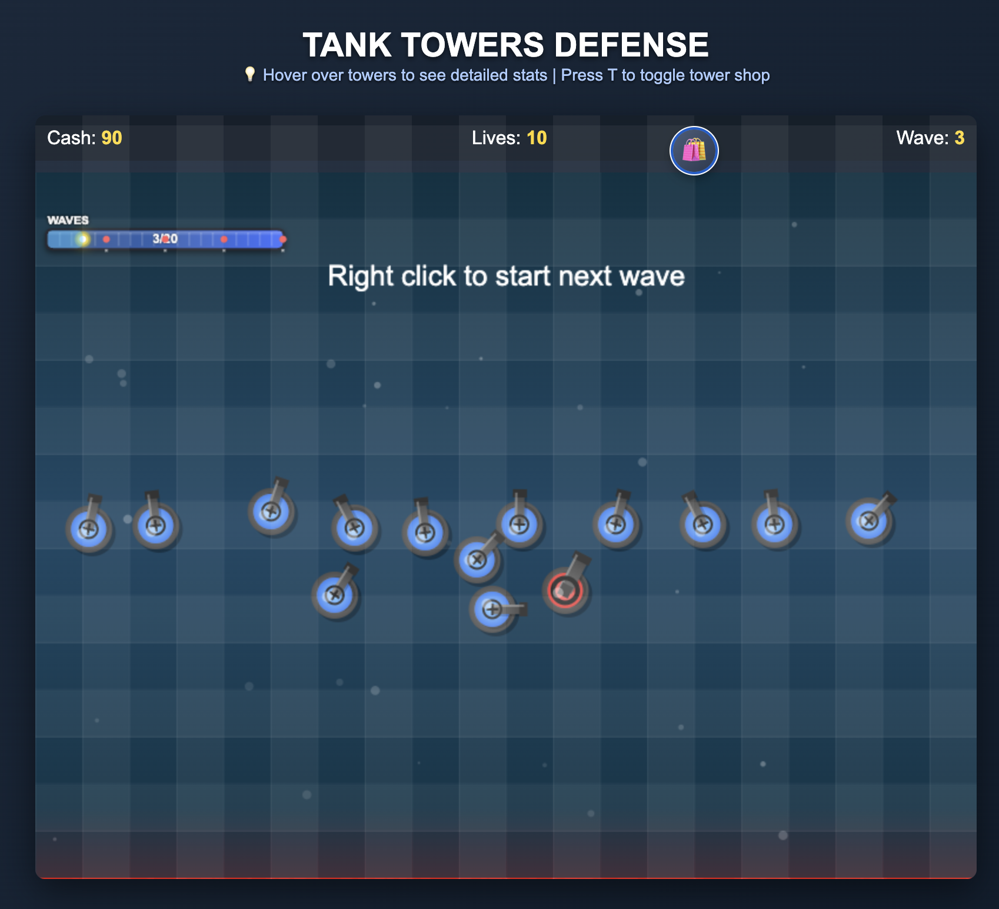

# Tank Towers Defense

A fun tower defense game where you build different types of tank towers to defend against waves of enemies.



## Features

- Multiple tower types: Basic Tank, Semi Auto, Super Shooter, and special unlockable towers
- Tower upgrade system: Upgrade your towers up to 3 levels to increase their effectiveness
- Special tower abilities: Unlock ice, flame, and bomber towers as you progress
- 20 waves of enemies with increasing difficulty
- Boss waves every 5 levels
- Interactive UI with tower selection, upgrade, and selling options
- Visual effects for battles, upgrades, and game events
- Victory and game over screens

## How to Play

1. Click on tower buttons to select a tower type
2. Click on the game field to place the selected tower
3. Right-click or press Space to start the next wave
4. Click on existing towers to select them:
   - Use the Upgrade button to improve their stats
   - Use the Sell button to remove them and get cash back
5. Press T to toggle the tower shop visibility
6. Survive all 20 waves to win!

## Tower Types

- **Basic Tank**: Balanced stats, good starting tower
- **Semi Auto**: Fast firing rate but lower damage
- **Super Shooter**: High damage but slow firing rate
- **Ice Tank**: Unlocks after wave 5, can slow down enemies
- **Flamer**: Unlocks after wave 10, deals damage over time
- **Bomber**: Unlocks after wave 15, deals splash damage

## Getting Started

### Prerequisites

- Node.js installed on your machine

### Installation

1. Clone the repository
   ```
   git clone https://github.com/yourusername/tank-towers.git
   ```

2. Navigate to the project directory
   ```
   cd tank-towers
   ```

3. Start the server
   ```
   node server.js
   ```

4. Open your browser and go to `http://localhost:8080`

## Technical Details

- Built with vanilla JavaScript, HTML, and CSS
- Uses HTML Canvas for rendering
- Modular code structure with separate files for game, towers, enemies, and projectiles

## License

This project is licensed under the MIT License - see the LICENSE file for details. 